# 💊 Supplement.ge

<div align="center">


**A modern, premium e-commerce mobile application for supplements and fitness products**

[Features](#-features) • [Screenshots](#-screenshots) • [Installation](#-installation) • [Project Structure](#-project-structure) • [Tech Stack](#-tech-stack)

</div>

---

## 🌟 Features

### 🛒 E-Commerce Core
- **Product Catalog** - Browse supplements with advanced filtering
- **Shopping Cart** - Add/remove items, quantity management
- **Checkout Flow** - Complete order processing with address & payment
- **Order History** - Track all your orders with detailed status

### 🏋️ Training Programs
- **Professional Programs** - Curated training plans by expert trainers
- **Filtering System** - Filter by difficulty, duration, and goals
- **Program Details** - Full workout breakdown with schedules

### 🤖 AI Assistant
- **Smart Recommendations** - AI-powered supplement suggestions
- **Chat History** - Persistent conversation history for logged-in users
- **Quick Questions** - Pre-defined queries for fast assistance

### 👤 User Experience
- **Authentication** - Login/Register with guest mode option
- **Profile Management** - Edit personal info, addresses, payment methods
- **Dark/Light Theme** - Full theme support with system preference
- **Multi-language** - English and Georgian (ქართული) support
- **Favorites** - Save products for later

### 🎨 Premium Design
- **Glassmorphism Effects** - Modern blur and transparency effects
- **Smooth Animations** - Polished micro-interactions
- **Responsive Layout** - Optimized for all screen sizes
- **Bottom Sheet Modals** - Native-feeling modal presentations

---

## 📱 Screenshots

### App Preview

<p align="center">
  
</p>

### Core Screens

<p align="center">
  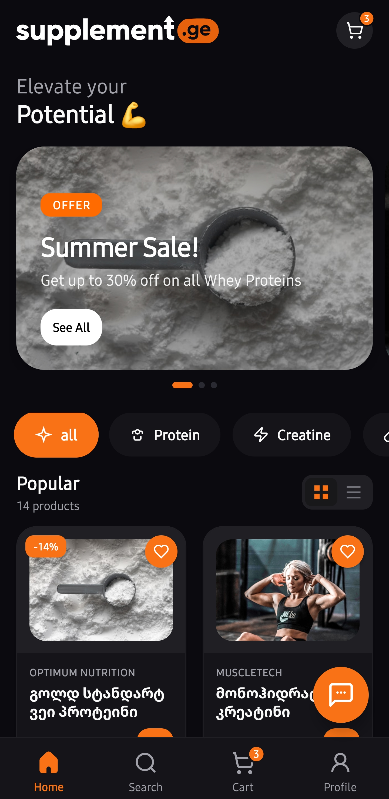
  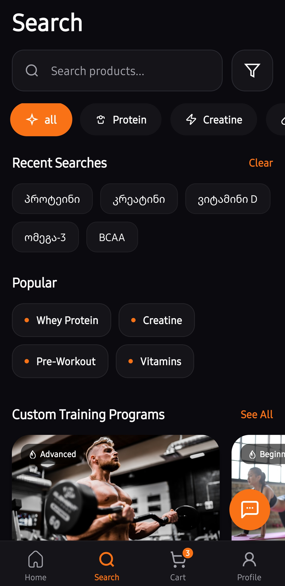
  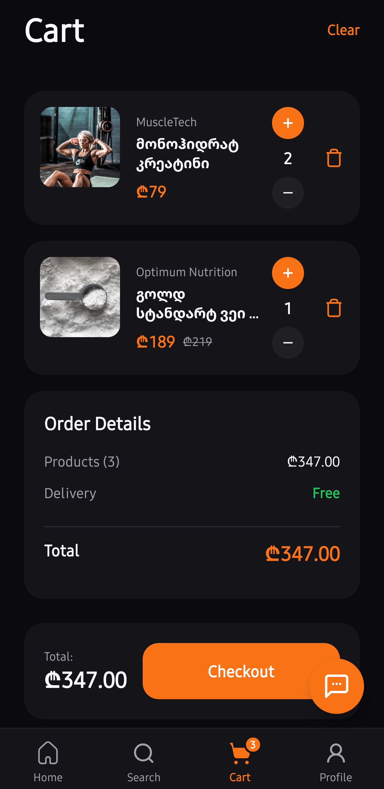
  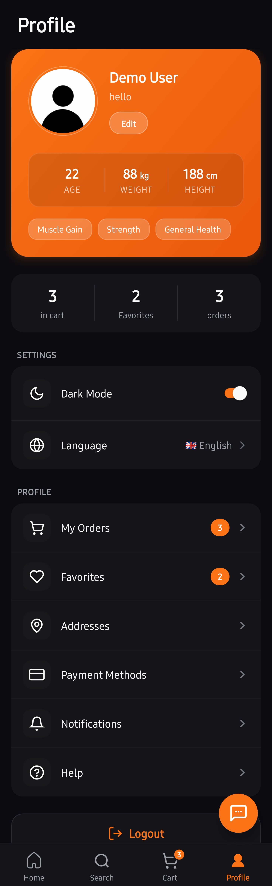
</p>

| Home | Search | Cart | Profile |
|:----:|:------:|:----:|:-------:|
| Browse products & offers | Search & filter | Manage cart | User settings |

### Product & Shopping

<p align="center">
  
  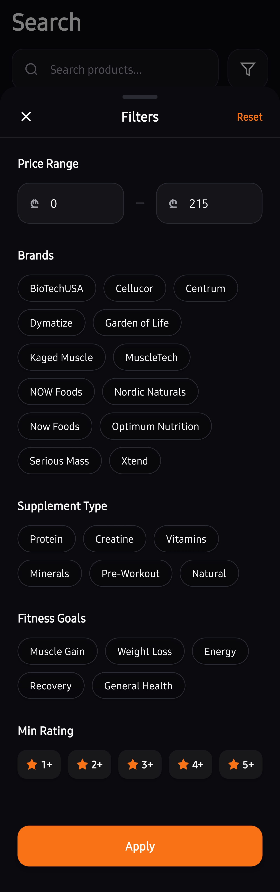
  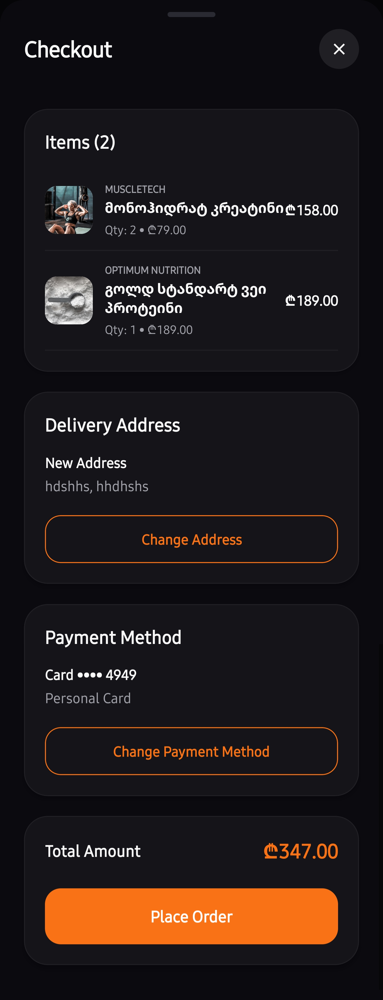
  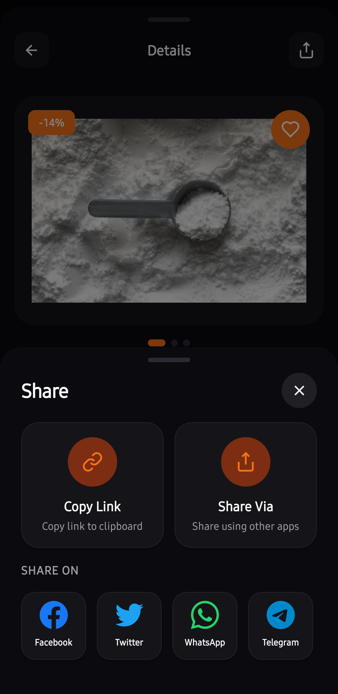
</p>

| Product Detail | Filters | Checkout | Share |
|:--------------:|:-------:|:--------:|:-----:|
| Full product info | Advanced filtering | Complete order | Share products |

### Profile Features

<p align="center">
  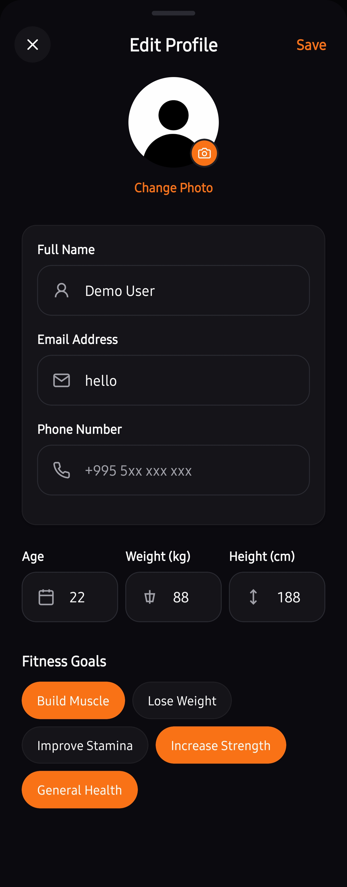
  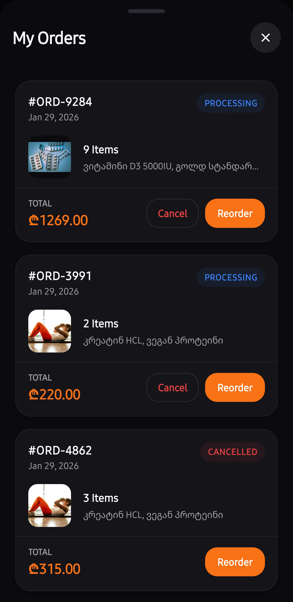
  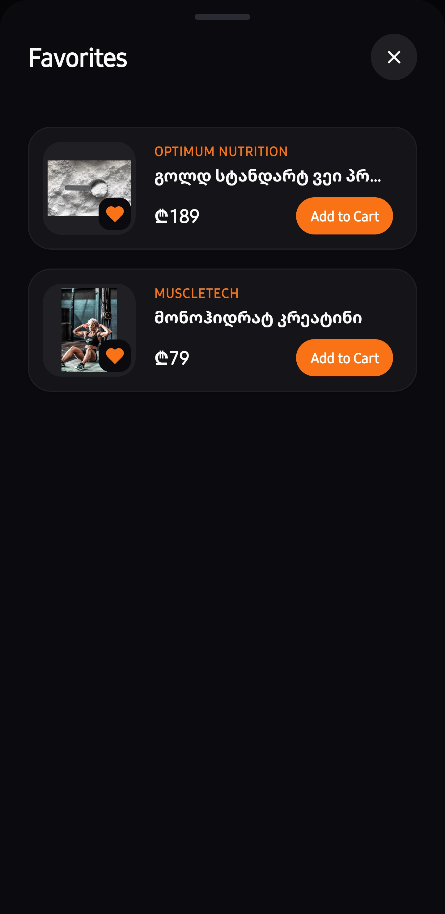
  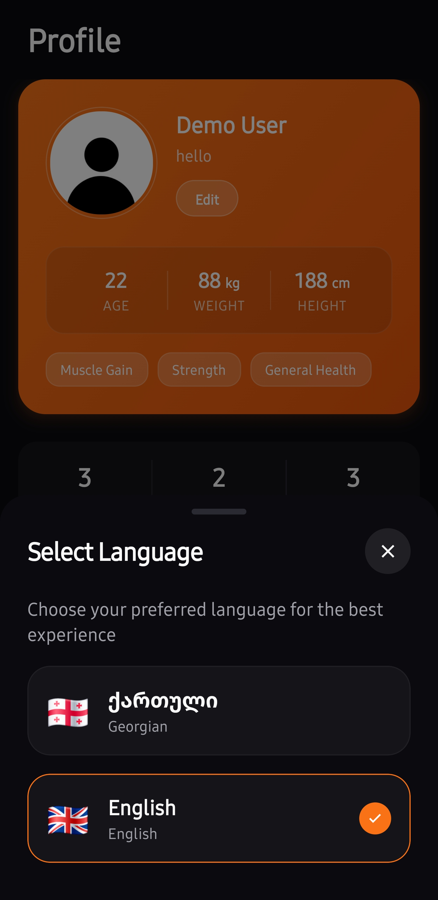
</p>

| Edit Profile | Orders | Favorites | Language |
|:------------:|:------:|:---------:|:--------:|
| Manage account | Order history | Saved items | EN/KA support |

### Payment & Settings

<p align="center">
  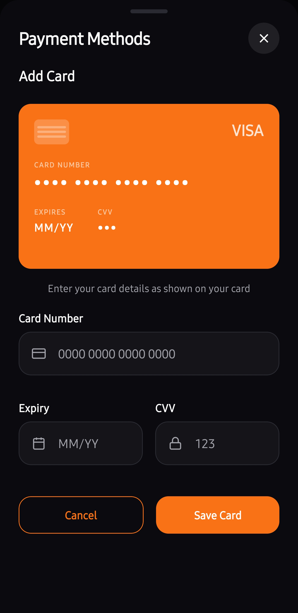
  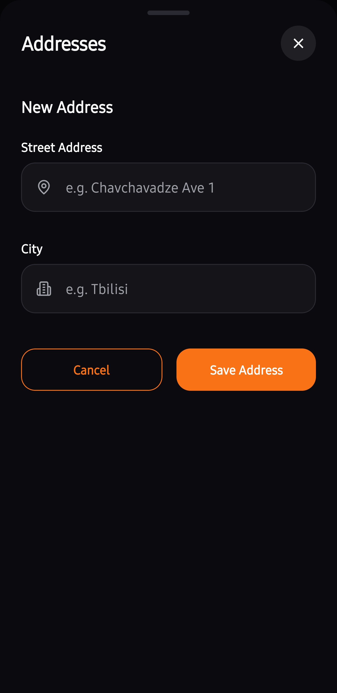
  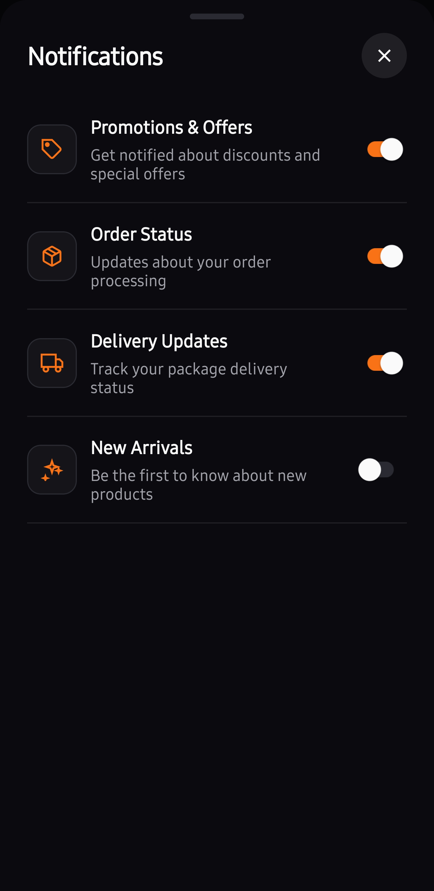
  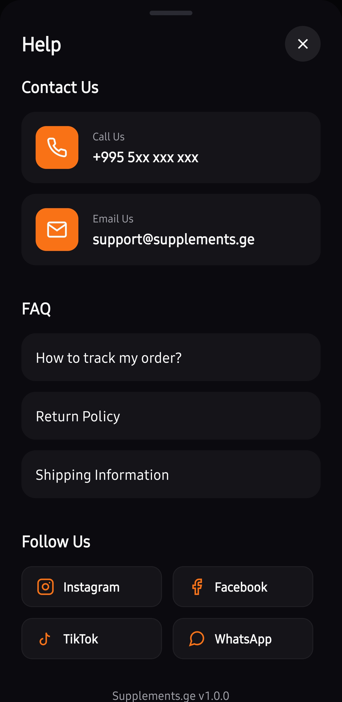
</p>

| Payment | Addresses | Notifications | Help |
|:-------:|:---------:|:-------------:|:----:|
| Card preview | Manage addresses | Alert settings | FAQ & contact |

### Training Programs

<p align="center">
  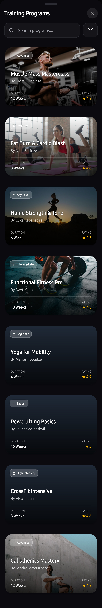
  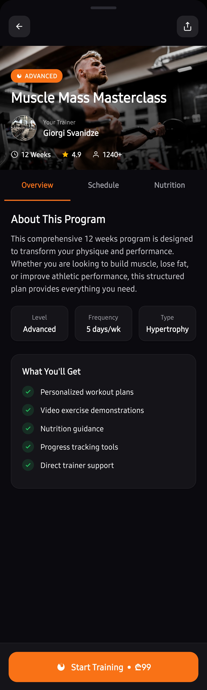
  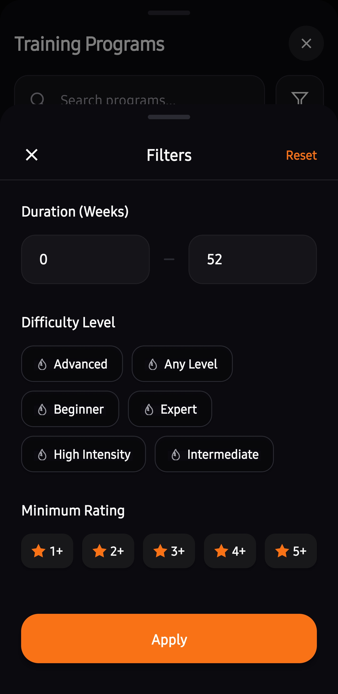
  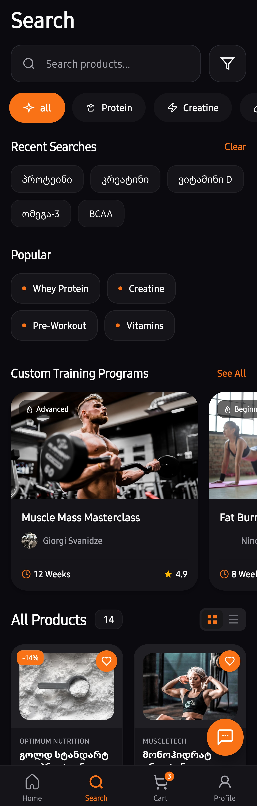
</p>

| Programs List | Program Detail | Filters | Overview |
|:-------------:|:--------------:|:-------:|:--------:|
| Browse programs | Full details | Filter options | Quick view |

### Dark & Light Theme

<p align="center">
  
  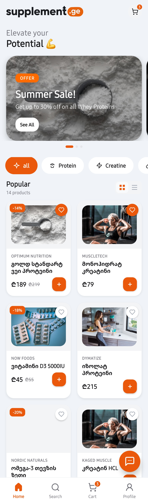
</p>

| Dark Mode | Light Mode |
|:---------:|:----------:|
| Default dark theme | Clean light theme |

---

## 🚀 Installation

### Prerequisites

- **Node.js** (v18 or higher)
- **npm** or **yarn**
- **Expo CLI** (`npm install -g expo-cli`)
- **iOS Simulator** (macOS) or **Android Emulator**

### Quick Start

```bash
# Clone the repository
git clone https://github.com/gfifia/supplements_ge.git

# Navigate to project directory
cd supplements_ge

# Install dependencies
npm install

# Start the development server
npm start
```

### Running on Devices

```bash
# iOS Simulator
npm run ios

# Android Emulator
npm run android

# Web Browser
npm run web
```

### Building for Production

```bash
# Create production build for iOS
eas build --platform ios --profile production

# Create production build for Android
eas build --platform android --profile production

# Create web build
npx expo export --platform web
```

---

## 📁 Project Structure

```
supplements_ge/
├── 📱 App.tsx                    # App entry point
├── 📄 app.json                   # Expo configuration
├── 📄 package.json               # Dependencies
│
├── 📂 src/
│   ├── 📂 components/
│   │   ├── 📂 cart/              # Cart-related components
│   │   ├── 📂 common/            # Reusable UI components
│   │   │   ├── AIChatModal       # AI assistant chat
│   │   │   ├── AuthModal         # Login/Register
│   │   │   ├── BottomSheetModal  # Modal wrapper
│   │   │   ├── Button            # Themed button
│   │   │   ├── CheckoutModal     # Order checkout
│   │   │   ├── FilterModal       # Product filters
│   │   │   ├── Input             # Form input
│   │   │   ├── ProductCard       # Product display
│   │   │   ├── ProductDetailModal# Product details
│   │   │   ├── TrainingProgramModal # Training details
│   │   │   └── ... (40+ components)
│   │   └── 📂 icons/             # SVG icon components
│   │
│   ├── 📂 constants/
│   │   ├── theme.ts              # Color themes (light/dark)
│   │   ├── translations.ts       # i18n strings (EN/KA)
│   │   └── config.ts             # App configuration
│   │
│   ├── 📂 context/
│   │   ├── AppContext.tsx        # Global app state
│   │   ├── ModalContext.tsx      # Modal management
│   │   └── ToastContext.tsx      # Toast notifications
│   │
│   ├── 📂 data/
│   │   ├── mockData.ts           # Product catalog
│   │   └── training.ts           # Training programs
│   │
│   ├── 📂 hooks/
│   │   ├── useCart.ts            # Cart operations
│   │   ├── useFavorites.ts       # Favorites management
│   │   └── useResponsive.ts      # Responsive utilities
│   │
│   ├── 📂 navigation/
│   │   └── TabNavigator.tsx      # Bottom tab navigation
│   │
│   ├── 📂 screens/
│   │   ├── HomeScreen.tsx        # Main home feed
│   │   ├── SearchScreen.tsx      # Search & categories  
│   │   ├── CartScreen.tsx        # Shopping cart
│   │   ├── FavoritesScreen.tsx   # Saved products
│   │   └── ProfileScreen.tsx     # User profile
│   │
│   ├── 📂 services/
│   │   ├── api.ts                # API service layer
│   │   └── storage.ts            # AsyncStorage helpers
│   │
│   ├── 📂 types/
│   │   └── index.ts              # TypeScript definitions
│   │
│   └── 📂 utils/
│       ├── formatters.ts         # Data formatting
│       └── platform.ts           # Platform utilities
│
└── 📂 assets/                    # Images & fonts
```

---

## 🛠 Tech Stack

### Core
| Technology | Version | Purpose |
|------------|---------|---------|
| React Native | 0.81.5 | Cross-platform mobile framework |
| Expo | 54 | Development platform & tooling |
| TypeScript | 5.9 | Type-safe JavaScript |
| React | 19.1 | UI component library |

### Navigation & UI
| Technology | Purpose |
|------------|---------|
| React Navigation | Screen navigation & tabs |
| React Native SVG | Vector icons & graphics |
| Expo Blur | Glassmorphism effects |
| Expo Linear Gradient | Gradient backgrounds |

### State & Storage
| Technology | Purpose |
|------------|---------|
| React Context | Global state management |
| AsyncStorage | Local data persistence |

### Styling
| Technology | Purpose |
|------------|---------|
| NativeWind | Tailwind CSS for React Native |
| StyleSheet | Native styling API |

---

## ⚙️ Configuration

### Environment Variables

Create a `.env` file in the root directory:

```env
# API Configuration
API_BASE_URL=https://api.supplements.ge

# Feature Flags
ENABLE_AI_CHAT=true
ENABLE_ANALYTICS=false
```

### Theme Customization

Edit `src/constants/theme.ts` to customize colors:

```typescript
export const lightColors = {
  accent: '#FF6B35',      // Primary brand color
  background: '#FFFFFF',  // Background
  surface: '#F8F9FA',     // Cards & surfaces
  text: '#0F0F0F',        // Primary text
  // ...
};
```

### Translations

Add new languages in `src/constants/translations.ts`:

```typescript
export const translations = {
  en: { /* English strings */ },
  ka: { /* Georgian strings */ },
  // Add more languages...
};
```

---

## 📦 Building for App Stores

### iOS (App Store)

1. Configure `app.json` with your bundle identifier
2. Generate certificates via Expo EAS
3. Build and submit:
   ```bash
   eas build --platform ios --profile production
   eas submit --platform ios
   ```

### Android (Play Store)

1. Configure `app.json` with your package name
2. Generate keystore via Expo EAS
3. Build and submit:
   ```bash
   eas build --platform android --profile production
   eas submit --platform android
   ```

---

## 🔒 Security Notes

- User credentials are stored locally using AsyncStorage
- No sensitive data is transmitted without encryption
- API calls should use HTTPS in production
- Consider implementing:
  - Token-based authentication
  - Secure key storage (Expo SecureStore)
  - Certificate pinning

---

## 🤝 Contributing

1. Fork the repository
2. Create your feature branch (`git checkout -b feature/AmazingFeature`)
3. Commit your changes (`git commit -m 'Add some AmazingFeature'`)
4. Push to the branch (`git push origin feature/AmazingFeature`)
5. Open a Pull Request

---

## 📄 License

This project is proprietary software. All rights reserved.

---

## 👨‍💻 Author

**gabriel pipia**

- GitHub: [@gabriel-pipia](https://github.com/gabriel-pipia)

---

## 🙏 Acknowledgments

- [Expo](https://expo.dev/) - Amazing development platform
- [React Native](https://reactnative.dev/) - Mobile framework
- [React Navigation](https://reactnavigation.org/) - Navigation library

---

<div align="center">

**Made with ❤️ in Georgia 🇬🇪**

</div>
